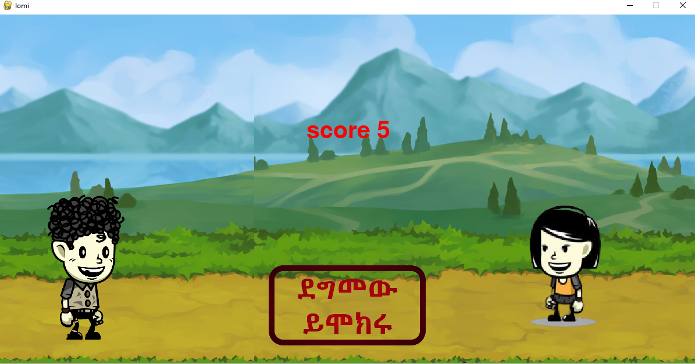

# Lomi-Bwerewr


  This Pygame project, developed as part of a school assignment, brings to life a traditional Ethiopian game celebrated during the Epiphany, especially in Gonder city. The game reflects a local custom where a boy throws lemons at a girl to express his interest in her. If she finds his gesture appealing, she joins him in the festive celebrations. This playful interaction is a unique way for unmarried youngsters to connect during the holiday. By digitizing this tradition, the game preserves an important aspect of Ethiopian cultural heritage, allowing the younger generation to engage with and appreciate these customs in a modern format.

## Overview

"Lomi Bwerewr" is an action-packed 2D game developed using Pygame. The game centers around two characters: a boy and a girl. The boy throws lemons while the girl runs and jumps to avoid them. The objective is to dodge as many lemons as possible to keep the girl alive. The game ends when the girl gets hit by a lemon.

## Features

- **Dynamic Background**: A scrolling background that creates an immersive environment.
- **Character Animation**: Both the boy and girl have smooth, animated sprites for running, throwing, jumping, and more.
- **Lemon Throwing**: Lemons are periodically thrown by the boy, with increasing difficulty as time progresses.
- **Sound Effects and Music**: The game includes background music, sound effects for jumping, and throwing lemons.
- **Start and Game Over Screens**: Interactive screens to start the game and restart after the game ends.

## Gameplay

1. **Start Screen**: 
    - Click "ጀምር" on the screen to start the game. Which means "Start the game" in Amharic.
    - The game begins with the boy and girl ready to play.
     

2. **In-Game**:
    - The girl will automatically run across the screen.
     
    - Press the `SPACE` arrow key to make the girl jump and avoid the lemons.
     
    - Each lemon avoided increases the player's score.
    - The game speeds up, making it more challenging as the score increases.
     

3. **Game Over**:
    - If the girl is hit by a lemon, the game ends, and a game over screen appears.
    - You can restart the game by clicking on the "ደግመው ይሞክሩ" button, which means "Play Again" in Amharic.
     

## Controls

- **Space Bar**: Make the girl jump to avoid the lemons.
- **Left Click**: Start the game clicking the "ጀምር" button.

## Installation

1. **Clone the repository**:
    ```bash
    git clone https://github.com/yourusername/lomi-bwerewr.git
    ```
2. **Navigate to the project directory**:
    ```bash
    cd lomi-bwerewr
    ```
3. **Install the dependencies**:
    ```bash
    pip install pygame
    ```
4. **Run the game**:
    ```bash
    python main.py
    ```

## Assets

- Background image, character sprites, lemons, and sound effects are stored in the `assets/` directory.
- Ensure all assets are correctly placed for the game to run smoothly.